# web_assignment3
student:Atshybai Nurbolsyn     group:IT-2503         course:frontend

the Assignment #3. Responsive Web Design (Media Queries + Bootstrap Grid)
My web:http://127.0.0.1:5500/index.html#

objective:The goal of this assignment is to learn how to create responsive web pages using CSS Media Queries and the Bootstrap Grid system. 

Task Zero: 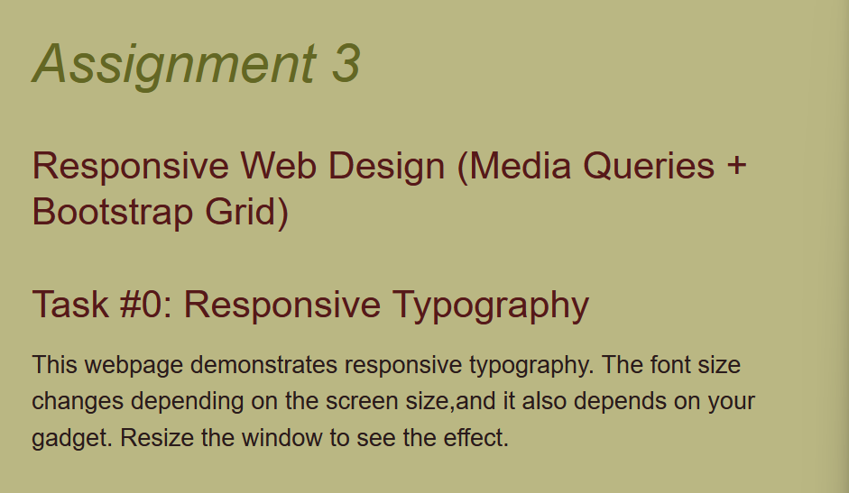 : 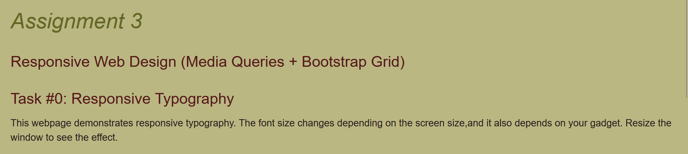
there our webpage demostrates responsive typography, it means the font size changes depending on screen size. (ex:tablet,phone,PC)

task one: 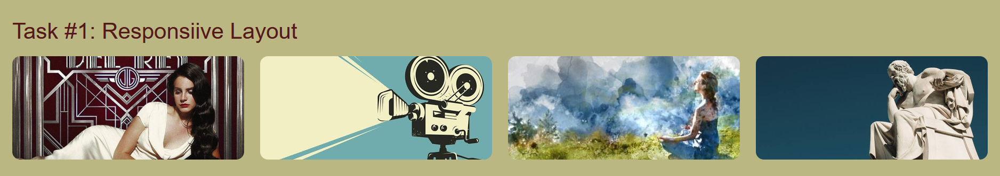 :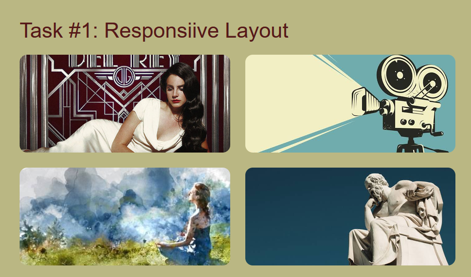 the assignment asked us create 3 box but i puted four responsive boxes using CSS media queries. Also this can shange depending on gadget for example on PC and maybe tablet the boxes display horizontally, oh phone it displays vetically.

task two: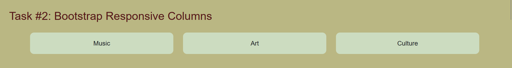 :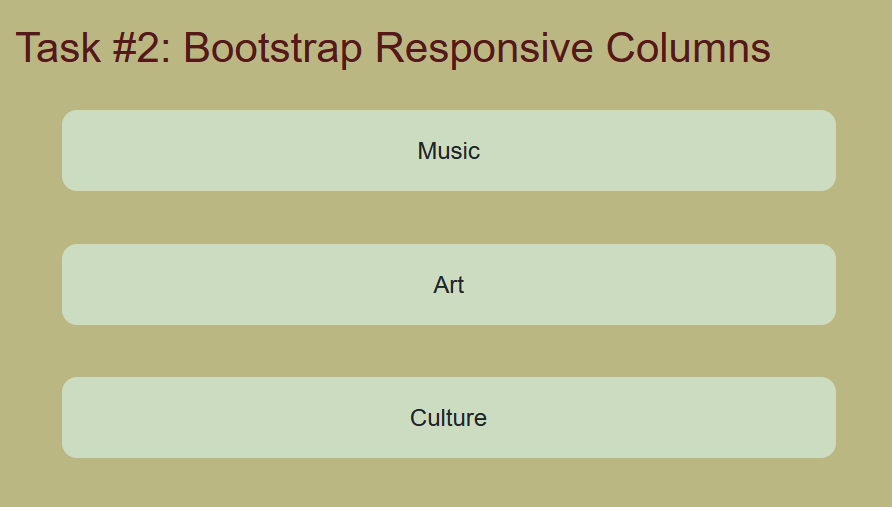
there are also crated boostrap boxes they are also dispays vertically and horizontaly depending on your gadget.

task three: 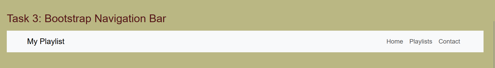 :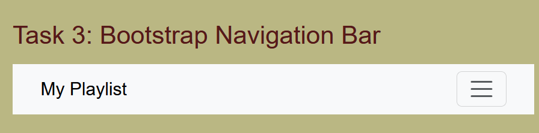 there is navigation bar used boostrap 

task four: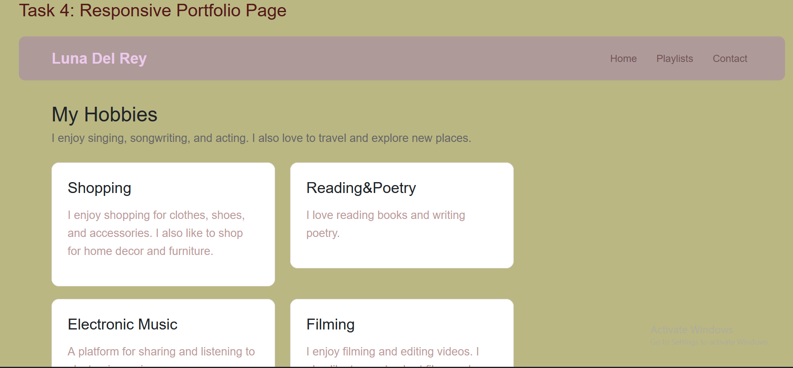 :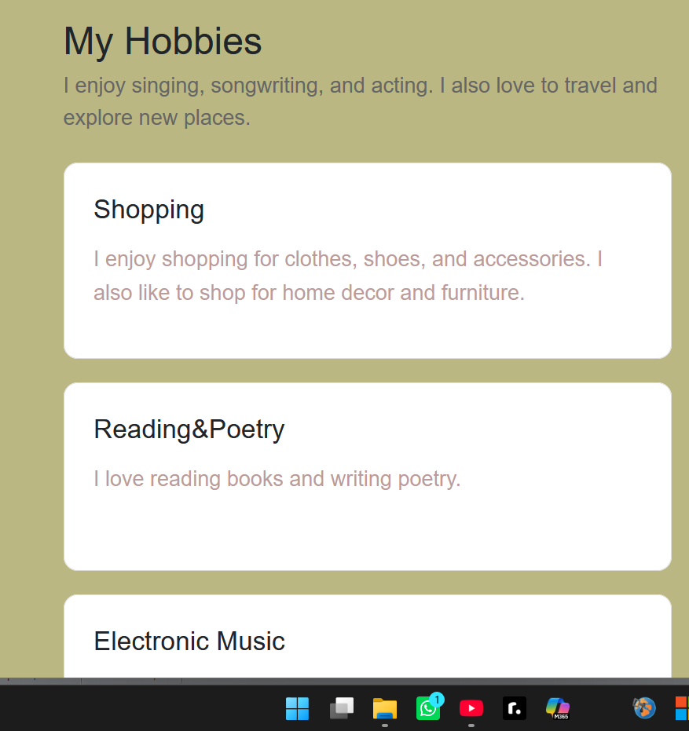 :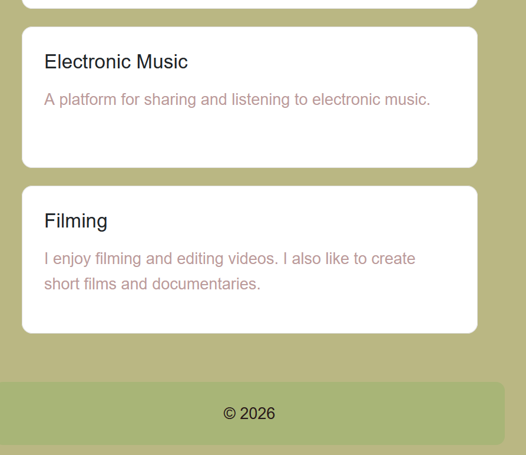 
 
